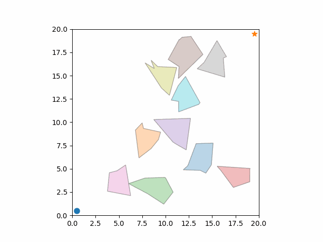

# Roadmap-based Planning

## Introduction

This project provides a modular pipeline for generating 2D planning environments, building roadmaps, running search algorithms, and visualizing the results. All components are isolated:

* **C++** handles environment generation, roadmap construction, and path search.
* **Python** orchestrates these modules via `main.py` and visualizes outputs.





## 1. Installation

Clone the repository and install Python requirements:

```bash
git clone <this-repo>
cd planning-example

pip install -r requirements.txt
````

The C++ modules require:

| Component | Minimum Version | Tested Version |
|----------|-----------------|----------------|
| **CMake** | ≥ 3.16 | 3.30.0 |
| **GCC / G++** | ≥ 9.0 (C++17 required) | 12.3.0 |
| **GNU Make** | ≥ 4.0 | 4.3 |
| **glibc** | ≥ 2.28 | 2.35 |

CMake automatically configures the build using the system toolchain.  
This project requires a compiler supporting **C++17** or later.

To check your versions:

```bash
cmake --version
gcc --version
g++ --version
make --version
ldd --version
```


## 2. Build Instructions

The project provides a build helper:

```bash
chmod +x build.py
./build.py         # Configure + build (default: Release)
./build.py --clean # Remove build directory
```

After building, all binaries appear in:

```text
build/bin/
    ├── build_env
    ├── build_roadmap
    └── build_path
```


## 🚀 Quick Usage

Running the entire pipeline is extremely simple.
If you execute the following command with **no arguments**:

```bash
python main.py
```

the system automatically performs **all three stages**:

1. **Environment Generation**

   * Creates a random 2D environment
   * Saves it as `results/env.txt`
   * Start and goal positions are automatically validated to be collision-free.

2. **Roadmap Construction**

   * Default roadmap algorithm: **`prm_random`**
   * Saves the graph to `results/graph.txt`
   * Uses deterministic seeding based on the environment seed + roadmap type.

3. **Path Search**

   * Default search algorithm: **`astar`**
   * Computes a path from start to goal on the roadmap
   * Saves the path to `results/path.txt`

4. **Visualization Output**
   
   Results are saved inside a timestamped folder. It may take a few minutes depending on the roadmap size and visualization steps.

   ```
   results/re-YYMMDD-HHMM/
       map_prm_random.png
       map_prm_random.gif                 # roadmap construction (STEP-based)
       map_prm_random_astar.png
       map_prm_random_astar.gif           # path-drawing animation
   ```

In short, it automatically executes:

✔ environment →
✔ roadmap →
✔ search →
✔ PNG export →
✔ GIF export

with no additional configuration required.


### Running individual stages

```bash
python main.py --env --seed 42
python main.py --map --roadmap rrt --seed 42
python main.py --search --roadmap gvd --search_method wastar --seed 42
```

Each mode corresponds to:

* `--env` → Stage 1
* `--map` → Stage1 and Stage 2
* `--search` → Stage1, Stage 2 and Stage 3 (full pipeline)


## 2-1. build_env: Role and Specifications
`build_env` is responsible for generating a **random 2D continuous environment** with polygonal obstacles and saving it to `results/env.txt`.

### World

* Continuous 2D space: **20 × 20**

### Start & Goal

* Start: **(0.5, 0.5)**
* Goal: **(19.5, 19.5)**
* These points **must not lie inside any obstacle**

### Obstacle Count

* Requested M is clamped:

  * **0 ≤ M ≤ 20**

### Obstacle Polygon Properties

Each obstacle is a **simple Jordan curve polygon** with:

* **Vertex count:** 4 to 8 (uniform random)
* **Area:** between **5 and 18** units² (shoelace formula)
* **Sampled uniformly** inside the world boundary
* **No overlap allowed**, ensured by:

  * Edge–edge intersection checks
  * Vertex-in-polygon checks (both directions)

### Output Format (`env.txt`)

```text
# seed <integer>
<M>                # number of generated obstacles
<K1>               # vertices in obstacle 1
x y
x y
...
<K2>
x y
...
<start_x> <start_y>
<goal_x>  <goal_y>
```

This file is later consumed by roadmap and search modules.

## 2-2. build_roadmap: Role and Specifications
`build_roadmap` takes an environment (`env.txt`) and constructs a **roadmap graph** according to a chosen method, writing it to `results/graph.txt`.

### Output Format (`graph.txt`)

```text
<N>                       # number of nodes
<id0> <x0> <y0>
<id1> <x1> <y1>
...
<M>                       # number of directed edges
<u0> <v0> <w0>            # edge 0: from u0 to v0 with length w0
<u1> <v1> <w1>
...
```

* Node IDs are 0-based integers.
* By convention, node `0` is the start configuration, node `1` is the goal.
* Edges are stored as directed pairs; undirected edges appear as two directed entries.

This runs:

1. `build_env` to create `env.txt`
2. `build_roadmap` with the selected `<roadmap_type>` to create `graph.txt`
3. Visualization (PNG + GIF) if saving is enabled.


## 2-3. build_path: Role and Specifications
`build_path` consumes the roadmap (`graph.txt`) and runs a selected search algorithm to compute a **collision-free path** from start (node 0) to goal (node 1).  
The result is written to `results/path.txt`.


### Output Format (`path.txt`)

```
<K>                 # number of points in the polyline
x0 y0
x1 y1
...
xK-1 yK-1
```

This file is consumed by the Python visualizer to draw the final solution trajectory.


## 3. Running From Python and Visualization

Environment-only:

```bash
python main.py --env
```

Environment + roadmap:

```bash
python main.py --map --roadmap prm_random
python main.py --map --roadmap rrt --save
```

When visualization and saving are enabled (`--save`), outputs are written under a timestamped folder:

```text
results/re-YYMMDD-HHMM/
    map.png                      # stage 1 (env only)
    map_<roadmap>.{png,gif}      # stage 2 (env + roadmap)
    map_<roadmap>_<search>.{png,gif}   # stage 3 (future: with path)
```

* PNG: final snapshot of the environment + roadmap (+ path at stage 3).
* GIF: simple time-lapse of roadmap construction based on logged node/edge order.


### Stage definition

| Stage | Description |
|------:|-------------|
| **1** | Environment only (obstacles, start, goal) |
| **2** | Roadmap graph added (PRM / Visibility / RRT / GVD) |
| **3** | Final search path added (A*, WA*, BFS, GBFS, …) |

Both PNG and GIF are generated automatically when `--save` is provided.


## 📬 Contact

If you encounter any issues, bugs, or have feature requests, please feel free to open an issue on GitHub.

Email: cmp9877@gmail.com
